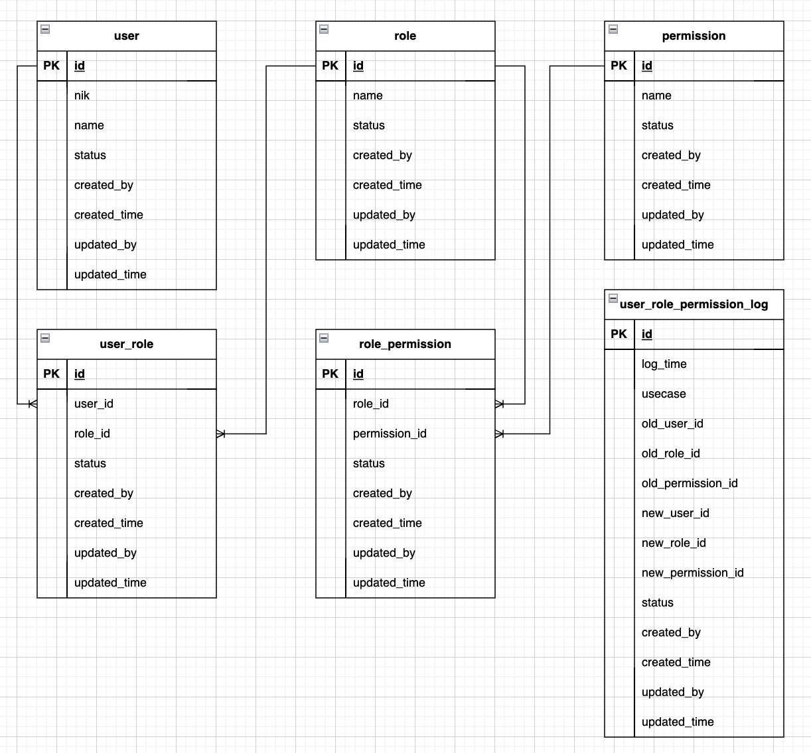

# Legends

- ❓: To be discussed

# Global Standard and Terminologies

- Required Key: Required key should be exist. The value should not be `undefined` or `null`. However, empty string is allowed.
- Optional key: Optional key can be ommited. The value might be `undefined` or `null`.

  Frontend need to check the value before parsing the value:

  ```javascript
  if (key in obj && obj[key] !== undefined && obj[key] !== null) {
    console.log("key exists");
  }
  ```

  Backend however is enforced to not give null object:

  ```go
  // status is required, ValidationError is optional
  type ResponseStruct struct {
      Status             string            `json:"status"`
      ValidationError    *ValidationError  `json:"validation_error,omitempty"`
  }
  ```

- Access Token and Refresh Token
  - Frontend uses Access Token to authenticate a user.
  - Access Token is used because we don't want to send username and password back and forth everytime.
  - Access Token has expiration, either embeded in the token (use non temperable mechanism) or mapped by backend.
  - Refresh Token has longer expiration than Access Token
  - When Frontend get 401 unauthorized from the backend, it will send refresh-token request, and Backend will send the new tokens (refresh and access)

# SQL Convention

- For primary key please use
  - `id`: If your priority is basic functionality, such as sorting and readability, using an auto-incrementing integer ID (id) is a straightforward and commonly used approach. It provides an efficient way to uniquely identify records and facilitates sorting operations.
  - `uuid4`: For enhanced security against spoofing attacks and ensuring globally unique identifiers, consider using Universally Unique Identifiers (UUIDs) generated using version 4 (uuid4). While UUIDs offer excellent security, it's important to note that they cannot be easily sorted due to their random nature. However, they are highly recommended for scenarios where security is paramount.
  - `ulid`: If you need a compromise between the security of UUIDs and the ability to sort records, consider using Universally Unique Lexicographically Sortable Identifiers (ULIDs). ULIDs combine the uniqueness of UUIDs with the ability to be sorted lexicographically. This makes them suitable for scenarios where both security and sorting capabilities are important.

# Common Response

Common response contains of the following fields:

- `status` (required, string): Error code, or `SUCCESS`.
- `error_message` (optional, string): User readable error message.
- `data` (required, any):
  - For `getting list of entities`, this should return a list.
  - For `getting a single entity`, `update`, or `delete`, this should return an object.
  - Otherwise, we will define this per template.
- `paging` (optional, required only when `getting list of entities`)
  - `page` (required, int): Page index
  - `total` (required, int): Total rows/data.

# Common CRUD

## GET `/api/v1/<entity>`

Getting list of entities.

Header

```
Authorization: Bearer <token>
```

Query Param

- `limit` (optional, int).
- `offset` (optional, int).
- ❓ `filters[<field>][<operator>]` (optional, any): Field filter (see: [strapi](https://docs.strapi.io/dev-docs/api/rest/filters-locale-publication)).
  - Example: `?filters[username][$eq]=ari&filters[age][$gt]=20`
  - List of operators:
    - `$eq`
    - `$ne`
    - `$gt`
    - `$gte`
    - `$lt`
    - `$lte`
    - `$contains`
    - `$notContains`
- ❓ `sortBy` (optional, string): Field name
- ❓ `sortOrder` (optional, string, default: `asc`): Either `asc` or `desc`.

Response

```json
{
  "status": "INVALID_SOMETHING",
  "error_message": "",
  "data": [
    {} // object
  ]
}
```

## GET `/api/v1/<entity>/<id>`

Getting a single entity.

Header

```
Authorization: Bearer <token>
```

Query Param

- `<field>`: `str`

Response

```json
{
  "status": "INVALID_SOMETHING",
  "error_message": "",
  "data": {} // object
}
```

## POST `/api/v1/<entity>`

Inserting a new entity.

Header

```
Authorization: Bearer <token>
```

Request

```json
{
  "<field>": "value"
}
```

Response

```json
{
  "status": "INVALID_SOMETHING",
  "error_message": "",
  "data": {
    "id": "<new-id>",
    "<field>": "value"
  }
}
```

## PUT `/api/v1/<entity>/<id>`

Updating an existing entity, must provide all fields.

Header

```
Authorization: Bearer <token>
```

Request

```json
{
  "<field>": "value"
}
```

Response

```json
{
  "status": "INVALID_SOMETHING",
  "error_message": "",
  "data": {
    "id": "<existing-id>",
    "<field>": "value"
  }
}
```

## PATCH `/api/v1/<entity>/<id>`

Updating an existing entity, doesn't have to provide all fields.

> Is this needed?

Header

```
Authorization: Bearer <token>
```

Request

```json
{
  "<field>": "value"
}
```

Response

```json
{
  "status": "INVALID_SOMETHING",
  "error_message": "",
  "data": {
    "id": "<existing-id>",
    "<field>": "value"
  }
}
```

## DELETE `/api/v1/<entity>/<id>`

Deleting an existing entity.

> Is this needed?

Header

```
Authorization: Bearer <token>
```

Response

```json
{
  "status": "INVALID_SOMETHING",
  "error_message": "",
  "data": {
    "id": "<existing-id>",
    "<field>": "value"
  }
}
```

# Login

## POST `/user/login`

Request

```json
{
  "user_id": "",
  "password": "" // RFC: hash??
}
```

Response

```json
{
  "status": "INVALID_SOMETHING",
  "error_meessage": "",
  "data": {
    "token": "",
    "refresh_token": ""
  }
}
```

## POST `/user/refresh-token`

Header

```
Authorization: Bearer <token>
```

Request

```json
{
  "refresh_token": ""
}
```

Response

```json
{
  "status": "INVALID_SOMETHING",
  "error_message": "",
  "data": {
    "token": "",
    "refresh_token": ""
  }
}
```

# User Matrix

## POST `/user/matrix`

> This should be `GET`, but currently we use `POST` since query parameter has size limitation.

Header

```
Authorization: Bearer <token>
```

Request

```json
{
  "refresh_token": "",
  "permissions": ["permission-1", "permission-2"]
}
```

Response

```json
{
  "status": "INVALID_SOMETHING",
  "error_message": "",
  "data": {
    "<permission-1>": true,
    "<permission-2>": false
  }
}
```

# User, Role, and Permission

## Entity Relational Diagram:



Definition:

- User representing a single user.
- Role representing a user role (e.g., `administrator`, `tester`, etc.).
- Permission representing a granular authorization (e.g., `read_payment`, `create_payment`, etc.).

Ordinality:

- A single user might has multiple roles.
- A single role might be assigned to multiple users.
- A single role might contains multipe permissions.
- A single permission might be assigned to multiple roles.

## User

URL:

- GET, POST, PUT, DELETE, PATCH: `/api/v1/users`: User CRUD.

Data:

```json
{
  "id": "",
  "username": ""
}
```

> To get user roles/permissions, use role/permission API

## Role

URL:

- GET, POST, PUT, DELETE, PATCH: `/api/v1/roles`: Role CRUD.

Data:

```json
{
  "id": "",
  "role": ""
}
```

## Permission

URL:

- GET, POST, PUT, DELETE, PATCH: `/api/v1/permissions`: Permission CRUD.

Data:

```json
{
  "id": "",
  "permission": ""
}
```

## SQL Snytax

```sql
CREATE TABLE IF NOT EXISTS user(
    id SERIAL PRIMARY KEY,
    nik VARCHAR(255) NOT NULL,
    name VARCHAR(255) NOT NULL,
    status INT2 DEFAULT 1,
    created_by INT4 NOT NULL,
    created_time TIMESTAMP DEFAULT CURRENT_TIMESTAMP,
    updated_by INT4 NOT NULL,
    updated_time TIMESTAMP DEFAULT CURRENT_TIMESTAMP
);

CREATE TABLE IF NOT EXISTS role(
    id SERIAL PRIMARY KEY,
    name VARCHAR(255) NOT NULL,
    status INT2 DEFAULT 1,
    created_by INT4 NOT NULL,
    created_time TIMESTAMP DEFAULT CURRENT_TIMESTAMP,
    updated_by INT4 NOT NULL,
    updated_time TIMESTAMP DEFAULT CURRENT_TIMESTAMP
);

CREATE TABLE IF NOT EXISTS permission(
    id SERIAL PRIMARY KEY,
    name VARCHAR(255) NOT NULL,
    status INT2 DEFAULT 1,
    created_by INT4 NOT NULL,
    created_time TIMESTAMP DEFAULT CURRENT_TIMESTAMP,
    updated_by INT4 NOT NULL,
    updated_time TIMESTAMP DEFAULT CURRENT_TIMESTAMP
);

CREATE TABLE IF NOT EXISTS user_role(
    id SERIAL PRIMARY KEY,
    user_id SERIAL NOT NULL,
    role_id SERIAL NOT NULL,
    status INT2 DEFAULT 1,
    created_by INT4 NOT NULL,
    created_time TIMESTAMP DEFAULT CURRENT_TIMESTAMP,
    updated_by INT4 NOT NULL,
    updated_time TIMESTAMP DEFAULT CURRENT_TIMESTAMP
);

CREATE TABLE IF NOT EXISTS role_permission(
    id SERIAL PRIMARY KEY,
    role_id SERIAL NOT NULL,
    permission_id SERIAL NOT NULL,
    status INT2 DEFAULT 1,
    created_by INT4 NOT NULL,
    created_time TIMESTAMP DEFAULT CURRENT_TIMESTAMP,
    updated_by INT4 NOT NULL,
    updated_time TIMESTAMP DEFAULT CURRENT_TIMESTAMP
);

CREATE TABLE IF NOT EXISTS access_log(
    id SERIAL PRIMARY KEY,
    log_time TIMESTAMP DEFAULT CURRENT_TIMESTAMP,
    usecase VARCHAR(255) NOT NULL,
    old_user_id SERIAL,
    old_role_id SERIAL,
    old_permission_id SERIAL,
    new_user_id SERIAL,
    new_role_id SERIAL,
    new_permission_id SERIAL,
    status INT2 DEFAULT 1,
    created_by INT4 NOT NULL,
    created_time TIMESTAMP DEFAULT CURRENT_TIMESTAMP,
    updated_by INT4 NOT NULL,
    updated_time TIMESTAMP DEFAULT CURRENT_TIMESTAMP
);

CREATE TABLE IF NOT EXISTS
```

## Standarization for role access

To make it more readable we need to standarize the role access, each role access contain module or action separated by `+`. Also we using snake case for space in here. On code we should add validation to check whether the format is correct or not.

Example

```
access role to access user list page: USER_LIST
access role to create user in the user list page: USER_LIST+CREATE_USER
```

## Example

### user

id = 1
nik = 123
name = A

id = 2
nik = 234
name = B

### role

id = 10
name = IT Maker

id = 11
name = IT Checker

### permission

id = 20
name = USER_LIST

id = 21
name = USER_LIST+CREATE

id = 22
name = USER_LIST+APPROVE

id = 23
name = USER_LIST+DELETE

### role_permission

id = 30
role_id = 10
permission_id = 20

id = 31
role_id = 10
permission_id = 21

id = 32
role_id = 11
permission_id = 20

id = 33
role_id = 11
permission_id = 22

id = 34
role_id = 11
permission_id = 23

### user_role

id = 40
user_id = 1
role_id = 10

id = 41
user_id = 2
role_id = 11

---

Based on this example we have 2 user A and B, A's role is IT Maker that can view user list page and also can create user meanwhile B's role is IT Checker than can view user list page, approve user, delete user
